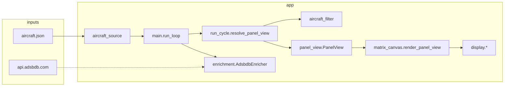

# idotadsb — production notes

Personal ADS-B feeder → iDotMatrix LED panel. This doc summarizes **architecture**, **v3 UI**, **optional squawk + quiet hours**, **ADSBDB enrichment**, and **how to run reliably**. Optional design specs (gitignored) can live under `docs/specs/` — e.g. `docs/specs/layoutcontract.md`, `docs/specs/version3spec.md`.

## Acknowledgments

**BLE / iDotMatrix:** Hardware uploads use **[markusressel/idotmatrix-api-client](https://github.com/markusressel/idotmatrix-api-client)** (declared in `requirements.txt`; Python import `idotmatrix`). idotadsb is a separate application that depends on that library for Bluetooth to the panel; the upstream repo is the right place for issues and changes to the client itself.

**License:** idotadsb is under **GNU GPLv3** — see the `LICENSE` file in the repository root.

---

## What it does

1. Poll **`aircraft.json`** from your receiver (readsb / dump1090 / SkyAware-style URL).
2. If **quiet hours** are active (local wall clock), **skip** feeder fetches and ADSBDB, and **dim/blank** the panel until the window ends.
3. If **squawk alerting** is enabled and the feed shows **7500 / 7600 / 7700**, show a **full-screen squawk alert** (latched until that aircraft clears the code or disappears). No v3 carousel and **no enrichment** while latched.
4. Otherwise run the **v3 carousel**: up to **`V3_ROTATE_TOP_N`** aircraft with hex + callsign, ordered by distance (from JSON `nm` or **`HOME_LAT`/`HOME_LON`**), alternating **Live** / **Identity** cards.
5. Render a **Pillow** canvas (64×64-style contract) and, with hardware, upload over **BLE** via [markusressel/idotmatrix-api-client](https://github.com/markusressel/idotmatrix-api-client) (`DISPLAY_BACKEND=idotmatrix_api_client`).

Optional **ADSBDB** lookups enrich v3 Identity + Live route line.

---

## Architecture (high level)



(Quiet-hours gating lives in `main.run_loop`; squawk/v3 carousel steps and filtering run inside `app/run_cycle.py`; `app/quiet_hours.py` supplies the time window helper.)

| Module | Role |
|--------|------|
| `app/config.py` | `Settings.from_env()` — all knobs from `.env` |
| `app/aircraft_source.py` | HTTP fetch + parse JSON → `list[Aircraft]` |
| `app/aircraft_filter.py` | Freshness, scoring, `top_n_v3_carousel`, emergency squawk helpers |
| `app/quiet_hours.py` | Local hour + overnight/same-day window for quiet hours |
| `app/main.py` | Main loop: quiet gate → fetch feed → `display.show_panel()` |
| `app/run_cycle.py` | Per-poll panel: squawk latch → v3 carousel → `PanelView`; refresh debouncing (`resolve_panel_view`, `should_refresh_display`) |
| `app/enrichment.py` | Background ADSBDB fetch, cache, merge with callsign endpoint |
| `app/panel_view.py` | `PanelView` kinds: `flight` / `idle` / `alert_squawk` + fingerprints |
| `app/matrix_canvas.py` | PNG layout (v3 cards, squawk 4-line alert) |
| `app/matrix_theme.py` | `MatrixColorProfile` (airline + motion colors) |
| `app/idotmatrix_diy.py` | Optional palette snap before BLE upload |
| `app/display_idotmatrix_api_client.py` | BLE client, DIY RGB upload, quiet-hours dim/restore |

---

## v3 carousel (normal operation)

| Setting | Role |
|---------|------|
| **`V3_ROTATE_TOP_N`** | Max aircraft in the rotating list (hex + callsign required per slot). |
| **`ROTATE_INTERVAL_SECONDS`** | Dwell on each aircraft before advancing the carousel. |
| **`POLL_INTERVAL_SECONDS`** | How often to fetch `aircraft.json`. |
| **`CARD_ROTATION_SECONDS`** | Alternation between Live vs Identity card for the **current** carousel aircraft. |

Scoring when distance is unknown uses RSSI + freshness + optional **`HOME_*`** (`ENABLE_DISTANCE`, `DISTANCE_BONUS_MAX`, etc.).

---

## v3: two alternating **slots** (not three card types)

`CARD_ROTATION_SECONDS` toggles between:

### Slot A — **Live** (`flight_card="live"`)

Rows (with route enrichment): **callsign** (airline accent) → **altitude** → **route** (`EWR→ORD`, larger band) → **motion** (`CLB`/`DSC`/`LVL`, speed `k`, cardinal). Left-aligned motion row.

Without route: three bands (callsign / alt / motion).

### Slot B — **Identity** (`flight_card="identity"`)

Same callsign on top; below it **two lines** from `EnrichmentData.identity_two_lines()`:

| Fields present | Line 1 | Line 2 |
|----------------|--------|--------|
| type + route | type | route |
| type + airline | type | airline |
| route + airline | route | airline |
| type only | type | *(empty)* |
| route only | route | *(empty)* |
| airline only | airline | *(empty)* |

**Type string:** ADSBDB `aircraft.type` (human text, e.g. `737 MAX 8`) is preferred when present; else `icao_type` (e.g. `B738`).

Identity only appears if enrichment has at least one of type / route / airline (`has_identity_card()`).

---

## Squawk emergency alert

- **Enable:** `SQUAWK_ALERTING_ENABLED=true`.
- **Codes:** **7500**, **7600**, **7700** (from the `squawk` field in `aircraft.json`).
- **UI:** Full-screen **ALERT / SQUAWK / code / flight** (`alert_squawk`); uses alert/chroma colors on BLE.
- **Latch:** Stays on that **hex** until the aircraft drops from the feed or the squawk is no longer emergency-class. New emergencies use the same latch rules.
- **While latched:** No v3 carousel updates and **no** ADSBDB `schedule_fetch` (feeds still run for squawk detection only).

---

## Quiet hours

- **Enable:** `QUIET_HOURS_ENABLED=true`.
- **Window:** `QUIET_HOURS_START_HOUR` / `QUIET_HOURS_END_HOUR` as integers **0–23** (whole hours only). If **start > end**, the quiet window **wraps midnight** (e.g. 23→7: quiet from 23:00 through 06:59). If **start < end**, quiet is the **same calendar day** span.
- **Timezone:** `QUIET_HOURS_TIMEZONE` (IANA, e.g. `America/New_York`) or empty for **system/local** (`TZ` on the Pi).
- **Behavior:** No `aircraft.json` fetch, no enrichment; sleeps `QUIET_HOURS_POLL_INTERVAL_SECONDS` between checks. BLE dims + black frame per `QUIET_HOURS_BRIGHTNESS_PCT` / panel limits.

---

## ADSBDB enrichment

- **When:** `ENABLE_ADSBDB_ENRICHMENT=true` (and not in quiet hours; not while a squawk alert is latched).
- **What:** For each aircraft in the current v3 top-N set, schedule `GET /v0/aircraft/{hex}?callsign=…`; may add `GET /v0/callsign/{callsign}` if route/airline still missing.
- **TLS:** Uses **certifi** CA bundle for `urllib` (important on macOS Python).
- **Cache:** TTL + refetch interval + min gap between requests; **callsign change** on same hex triggers refetch. Fresh cache merge prefers new route/airline after refetch.

---

## Configuration essentials

Copy **`.env.example` → `.env`** (`.env` is gitignored).

Production checklist:

- **`DATA_SOURCE_URL`** — reachable from the machine running the app (Pi or laptop).
- **`DISPLAY_BACKEND=idotmatrix_api_client`** — included in **`requirements.txt`** (GitHub `idotmatrix-api-client`, not the unrelated PyPI `idotmatrix` package).
- **`IDOTMATRIX_BLE_ADDRESS`** — set for real hardware.
- **`IDOTMATRIX_FONT_PATH`** — required for canvas on headless systems without DejaVu.
- **`HOME_LAT` / `HOME_LON`** — v3 carousel ordering by distance when JSON has no `nm`.
- **`POLL_INTERVAL_SECONDS`** — lower load on the Pi vs snappier updates.
- **`SQUAWK_ALERTING_ENABLED`** — optional emergency squawk takeover.
- **`QUIET_HOURS_*`** — optional nightly dim + pause (see [Quiet hours](#quiet-hours)).
- **`LOG_LEVEL=INFO`** — ADSBDB failures log at WARNING.

See `.env.example` for the full list.

---

## Running

Use **Python 3.12 or 3.13** when installing dependencies (the GitHub `idotmatrix-api-client` line requires it). If `python3 --version` is older, use `python3.12 -m venv .venv` (or install 3.12 first).

```bash
python3 -m venv .venv
source .venv/bin/activate   # Windows: .venv\Scripts\activate
pip install -r requirements.txt
cp .env.example .env   # then edit .env
python -m app.main
```

### Reactivate the venv (new shell, venv “deactivated”, or SSH)

The project uses a **repo-local** env at **`.venv/`** (gitignored). After `cd` to the repo root:

| Shell | Command |
|--------|---------|
| **bash / zsh (macOS, Linux, Pi)** | `source .venv/bin/activate` |
| **fish** | `source .venv/bin/activate.fish` |
| **Windows cmd** | `.venv\Scripts\activate.bat` |
| **Windows PowerShell** | `.\.venv\Scripts\Activate.ps1` |

You should see `(.venv)` in the prompt and `which python` / `where python` pointing inside `.venv`. Then run `python -m app.main` as usual.

If **`.venv` is missing**, recreate it with the block at the top of this section (use `python3.12 -m venv .venv` on systems whose default `python3` is still 3.9/3.10) → activate → `pip install -r requirements.txt`.

**Tests:** `pytest` from repo root (see `pytest.ini`).

**Feed only (no app):** check that `DATA_SOURCE_URL` returns JSON, e.g. `curl -sS --max-time 3 "$DATA_SOURCE_URL" | head -c 200`.

---

## Raspberry Pi deployment

### 1. Prerequisites on the Pi

- **Python 3.12 or 3.13** for the BLE stack: `idotmatrix-api-client` requires **`>=3.12,<3.14`**. Raspberry Pi OS **Bullseye** still ships **Python 3.9** as `python3` — that is **too old** and `pip install` will fail with “requires a different Python”. Prefer **Pi OS Bookworm** (or newer) and install **`python3.12`** (see below), or point your venv at any 3.12/3.13 you install via `pyenv` / another method.
- Check: `python3 --version` and, after installing: `python3.12 --version`.
- **Network** to your ADS-B host (same LAN is typical). The Pi must open `DATA_SOURCE_URL` (often `http://<feeder-ip>/skyaware/data/aircraft.json`).
- **Bluetooth** enabled and **BlueZ** running (default on Pi OS Desktop; on Lite, install/enable Bluetooth packages as needed).
- **Git** installed (`sudo apt update && sudo apt install -y git`) — required for `pip` to install the GitHub `idotmatrix-api-client` line in `requirements.txt`.

### 2. Copy the project to the Pi

Pick one:

```bash
# From GitHub (after you push)
git clone https://github.com/<you>/idotadsb.git
cd idotadsb
```

Or **rsync/scp** from your laptop (from the **repo root** — the directory that contains `app/` — → Pi), e.g.:

```bash
cd /path/to/idotadsb   # repo root, not a parent folder
rsync -avz --exclude '.venv' --exclude '.git' ./ pi@raspberrypi.local:~/idotadsb/
```

Use `./` as the source here. `./idotadsb/` only works if your current directory is the **parent** of the project folder (and the project is named `idotadsb`); otherwise rsync fails with `(l)stat: No such file or directory`.

Then on the Pi: `cd ~/idotadsb` (or your path).

### 3. Python venv and dependencies

On **Bookworm** (and many current Debian-based images), install a 3.12 toolchain and build headers, then create the venv with **`python3.12`** (not plain `python3` if that is still 3.9):

```bash
sudo apt update
sudo apt install -y python3.12 python3.12-venv python3.12-dev git \
  libjpeg-dev zlib1g-dev libffi-dev libssl-dev

cd ~/idotadsb   # or your clone path
python3.12 -m venv .venv
source .venv/bin/activate
pip install --upgrade pip
pip install -r requirements.txt
```

If **`python3.12` is not found**, your OS may be too old for the stock packages: **upgrade Raspberry Pi OS to Bookworm** (64-bit recommended), or install Python 3.12 another way (e.g. [pyenv](https://github.com/pyenv/pyenv)) and use that binary for `python3.12 -m venv .venv`.

If **Pillow** fails with **“headers or library files could not be found for jpeg”** (or pip builds Pillow from source and errors), install JPEG/zlib dev libs and retry:

```bash
sudo apt install -y python3.12-dev libjpeg-dev zlib1g-dev libjpeg62-turbo-dev
pip install -r requirements.txt
```

### 4. Configuration (`.env`)

```bash
cp .env.example .env
nano .env   # or your editor
```

Minimum to align with your laptop:

- **`DATA_SOURCE_URL`** — use a URL the **Pi** can reach (feeder LAN IP, not only `localhost` unless the feeder runs on the same Pi).
- **`DISPLAY_BACKEND=idotmatrix_api_client`**
- **`IDOTMATRIX_BLE_ADDRESS`** — BLE MAC of the panel (see below).
- **`IDOTMATRIX_FONT_PATH`** — on a headless Pi, set an explicit `.ttf`, e.g. after `sudo apt install -y fonts-dejavu-core`:

  `IDOTMATRIX_FONT_PATH=/usr/share/fonts/truetype/dejavu/DejaVuSans.ttf`

- Copy over **`HOME_*`**, v3 / ADSBDB / squawk / quiet-hours settings from your working laptop `.env` as needed.

### 5. Bluetooth address (optional but recommended)

With the panel powered and not connected to another device:

```bash
bluetoothctl
# scan on
# wait until you see IDM-… or similar, then:
# scan off
exit
```

Note the device **MAC** (e.g. `AA:BB:CC:DD:EE:FF`) and set `IDOTMATRIX_BLE_ADDRESS=` in `.env`.

Ensure the user running the app can use Bluetooth:

```bash
sudo usermod -aG bluetooth $USER
# log out and back in (or reboot)
```

### 6. Smoke test (foreground)

```bash
cd ~/idotadsb
source .venv/bin/activate
set -a && source .env && set +a   # load env into shell for curl test
curl -sS --max-time 3 "$DATA_SOURCE_URL" | head -c 200
python -m app.main
```

Stop with **Ctrl+C**. Fix `DATA_SOURCE_URL`, font path, or BLE until the panel updates.

### 7. Run at boot (systemd)

Use the unit in the [systemd](#systemd-optional-linux--pi) section below. Adjust **`User=`**, **`WorkingDirectory=`**, **`EnvironmentFile=`**, and **`ExecStart=`** to match the Pi user and paths. Then:

```bash
sudo systemctl daemon-reload
sudo systemctl enable --now idotadsb.service
journalctl -u idotadsb.service -f
```

---

## systemd (optional, Linux / Pi)

Example unit (adjust **`User=`** / **`Group=`** and paths if your login is not **`pi`**):

```ini
[Unit]
Description=idotadsb flight display
After=network-online.target

[Service]
Type=simple
User=pi
Group=pi
WorkingDirectory=/home/pi/idotadsb
EnvironmentFile=/home/pi/idotadsb/.env
ExecStart=/home/pi/idotadsb/.venv/bin/python -m app.main
Restart=on-failure
RestartSec=5

[Install]
WantedBy=multi-user.target
```

Ensure the service user can use **Bluetooth** (often `bluetooth` group).

---

## Related files (local, not in git)

The `docs/specs/` directory is **gitignored**. Keep your own copies there if you want layout/UI reference docs alongside the repo.

**Tracked maintenance notes:** optional future refactors and when they might be worth doing are listed in **[`REFACTOR_ROADMAP.md`](REFACTOR_ROADMAP.md)** (confirm before implementing).

---

## Version control

Use **`git init`** once at the repo root if you do not already have a `.git` directory. **Do not commit `.env`** (secrets); it is listed in `.gitignore`. Typical first steps:

```bash
git init
git add .
git status    # confirm .env is not staged
git commit -m "Initial commit: idotadsb display"
```

Add a remote (`git remote add origin …`) when you use GitHub/GitLab, then `git push -u origin main`.
