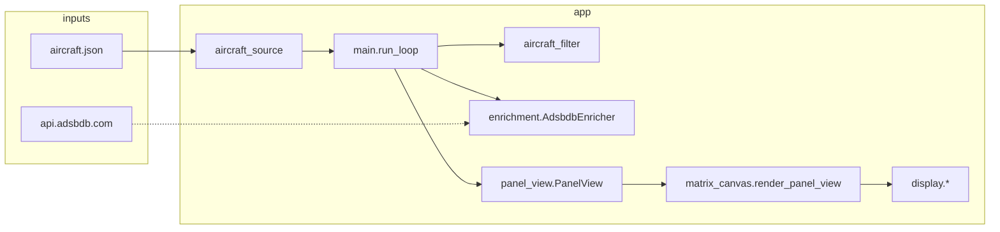

# idotadsb — production notes

Personal ADS-B feeder → iDotMatrix LED panel. This doc summarizes **architecture**, **v3 cards**, **data sources**, and **how to run it reliably**. Optional design specs (gitignored) can live under `docs/specs/` — e.g. `docs/specs/layoutcontract.md`, `docs/specs/version3spec.md`.

---

## What it does

1. Poll **`aircraft.json`** from your receiver (readsb / dump1090 / SkyAware-style URL).
2. Filter stale rows, then pick a **display mode** (`closest`, `rotate`, or `v3`).
3. Build a **`PanelView`** (flight / idle / alert).
4. Render a **Pillow canvas** (64×64-style contract) and, with hardware, upload over **BLE** via [markusressel/idotmatrix-api-client](https://github.com/markusressel/idotmatrix-api-client) (`DISPLAY_BACKEND=idotmatrix_api_client`).

Optional **ADSBDB** lookups enrich v3 with route, airline, and aircraft description.

---

## Architecture (high level)



| Module | Role |
|--------|------|
| `app/config.py` | `Settings.from_env()` — all knobs from `.env` |
| `app/aircraft_source.py` | HTTP fetch + parse JSON → `list[Aircraft]` |
| `app/aircraft_filter.py` | Freshness, scoring, `top_n_v3_carousel`, alerts (alerts skipped in v3) |
| `app/main.py` | Main loop: poll → `PanelView` → `display.show_panel()` |
| `app/enrichment.py` | Background ADSBDB fetch, cache, merge with callsign endpoint |
| `app/panel_view.py` | Semantic view + `critical_fingerprint` / `visual_fingerprint` (BLE debounce) |
| `app/matrix_canvas.py` | PNG layout (flight cards, alerts) |
| `app/matrix_theme.py` | `MatrixColorProfile` (airline + motion colors) |
| `app/idotmatrix_diy.py` | Optional palette snap before BLE upload |
| `app/display_idotmatrix_api_client.py` | BLE client, DIY RGB upload |

---

## Display modes

| Mode | Selection | Notes |
|------|-----------|--------|
| **`closest`** | Single best aircraft by score + debounce | Classic |
| **`rotate`** | Top `ROTATE_TOP_N` by score, advance every `ROTATE_INTERVAL_SECONDS` | Panel alerts allowed |
| **`v3`** | Top `V3_ROTATE_TOP_N` with **hex + callsign**, ordered by distance (or score fallback) | ADSBDB batch, **no** panel alert takeover |

Shared timing: **`POLL_INTERVAL_SECONDS`** between JSON polls; **`ROTATE_INTERVAL_SECONDS`** is also the **dwell per aircraft** in v3’s carousel.

---

## v3: two alternating **slots** (not three card types)

`CARD_ROTATION_SECONDS` toggles between:

### Slot A — **Live** (`flight_card="live"`)

Rows (with route enrichment): **callsign** (airline accent) → **altitude** → **route** (`EWR→ORD`, larger band) → **motion** (`CLB`/`DSC`/`LVL`, speed `k`, cardinal). Left-aligned motion row.

Without route: three bands (callsign / alt / motion).

### Slot B — **Identity** (`flight_card="identity"`)

Same callsign on top; below it **two lines** from `EnrichmentData.identity_two_lines()`:

| Fields present | Line 1 | Line 2 |
|----------------|--------|--------|
| type + route | type | route |
| type + airline | type | airline |
| route + airline | route | airline |
| type only | type | *(empty)* |
| route only | route | *(empty)* |
| airline only | airline | *(empty)* |

**Type string:** ADSBDB `aircraft.type` (human text, e.g. `737 MAX 8`) is preferred when present; else `icao_type` (e.g. `B738`).

Identity only appears if enrichment has at least one of type / route / airline (`has_identity_card()`).

---

## ADSBDB enrichment

- **When:** `DISPLAY_MODE=v3` and `ENABLE_ADSBDB_ENRICHMENT=true`.
- **What:** For each aircraft in the current v3 top-N set, schedule `GET /v0/aircraft/{hex}?callsign=…`; may add `GET /v0/callsign/{callsign}` if route/airline still missing.
- **TLS:** Uses **certifi** CA bundle for `urllib` (important on macOS Python).
- **Cache:** TTL + refetch interval + min gap between requests; **callsign change** on same hex triggers refetch.

---

## Configuration essentials

Copy **`.env.example` → `.env`** (`.env` is gitignored).

Production checklist:

- **`DATA_SOURCE_URL`** — reachable from the machine running the app (Pi or laptop).
- **`DISPLAY_BACKEND=idotmatrix_api_client`** — included in **`requirements.txt`** (GitHub `idotmatrix-api-client`, not the unrelated PyPI `idotmatrix` package).
- **`IDOTMATRIX_BLE_ADDRESS`** — set if multiple BLE devices exist.
- **`IDOTMATRIX_FONT_PATH`** — required for canvas on headless systems without DejaVu.
- **`HOME_LAT` / `HOME_LON`** — v3 carousel ordering by distance when JSON has no `nm`.
- **`POLL_INTERVAL_SECONDS`** — lower load on the Pi vs snappier updates.
- **`LOG_LEVEL=INFO`** — ADSBDB failures log at WARNING.

See `.env.example` for the full list.

---

## Running

```bash
python3 -m venv .venv
source .venv/bin/activate   # Windows: .venv\Scripts\activate
pip install -r requirements.txt
cp .env.example .env   # then edit .env
python -m app.main
```

**Tests:** `pytest` from repo root (see `pytest.ini`).

**Feed only (no app):** check that `DATA_SOURCE_URL` returns JSON, e.g. `curl -sS --max-time 3 "$DATA_SOURCE_URL" | head -c 200`.

---

## systemd (optional, Linux / Pi)

Example unit (adjust paths and user):

```ini
[Unit]
Description=idotadsb flight display
After=network-online.target

[Service]
Type=simple
WorkingDirectory=/home/pi/idotadsb
EnvironmentFile=/home/pi/idotadsb/.env
ExecStart=/home/pi/idotadsb/.venv/bin/python -m app.main
Restart=on-failure
RestartSec=5

[Install]
WantedBy=multi-user.target
```

Ensure the service user can use **Bluetooth** (often `bluetooth` group).

---

## Related files (local, not in git)

The `docs/specs/` directory is **gitignored**. Keep your own copies there if you want layout/UI reference docs alongside the repo.

---

## Version control

Use **`git init`** once at the repo root if you do not already have a `.git` directory. **Do not commit `.env`** (secrets); it is listed in `.gitignore`. Typical first steps:

```bash
git init
git add .
git status    # confirm .env is not staged
git commit -m "Initial commit: idotadsb display"
```

Add a remote (`git remote add origin …`) when you use GitHub/GitLab, then `git push -u origin main`.
